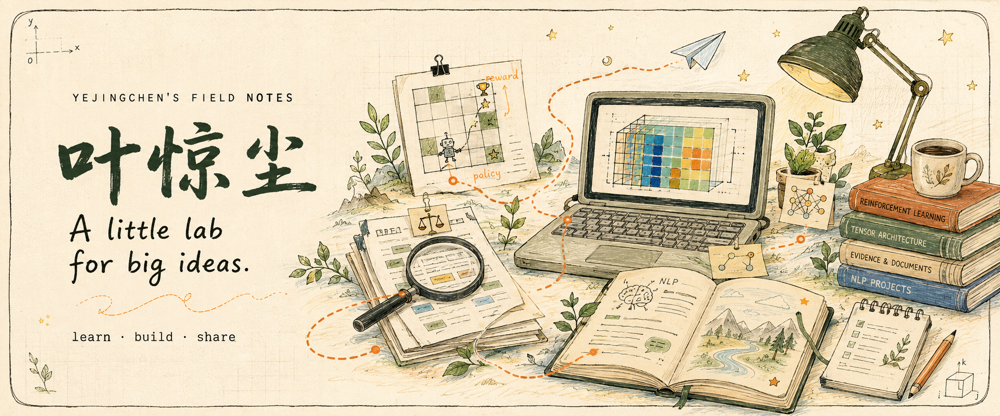
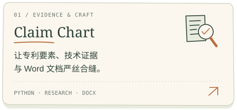
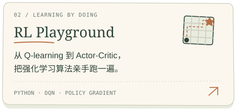
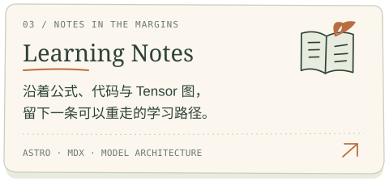
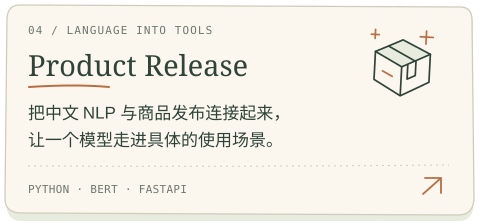
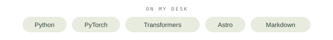
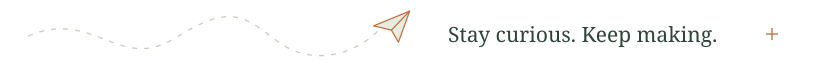

  

  <picture>
    <source media="(prefers-color-scheme: dark)" srcset="assets/hello-dark.svg">
    
  </picture>

  你好，我是 <strong>叶惊尘</strong>。 
  喜欢把复杂的东西拆开，再一点点弄明白。

  <a href="https://yejingchen123.github.io/"><strong>逛逛我的博客 ↗</strong></a> &nbsp; / &nbsp;
  <a href="#projects">项目小展台</a> &nbsp; / &nbsp;
  <a href="#notes">最近在写</a> &nbsp; / &nbsp;
  <a href="https://github.com/yejingchen123?tab=repositories">所有仓库</a>

 

## 01 &nbsp; 项目小展台

从一个想法，到一份能运行、能复用、能分享的作品。

  <a href="https://github.com/yejingchen123/claim-chart"><picture><source media="(prefers-color-scheme: dark)" srcset="assets/project-claim-dark.svg"></picture></a>
  <a href="https://github.com/yejingchen123/reinforcement_learning"><picture><source media="(prefers-color-scheme: dark)" srcset="assets/project-rl-dark.svg"></picture></a>
  <a href="https://yejingchen123.github.io/"><picture><source media="(prefers-color-scheme: dark)" srcset="assets/project-notes-dark.svg"></picture></a>
  <a href="https://github.com/yejingchen123/Product-Release"><picture><source media="(prefers-color-scheme: dark)" srcset="assets/project-product-dark.svg"></picture></a>

  <picture>
    <source media="(prefers-color-scheme: dark)" srcset="assets/toolbox-dark.svg">
    
  </picture>

 

## 02 &nbsp; 最近在写

给学习留一块可以慢慢生长的地方。把走过的推导，变成以后还能读懂的记录。

<!-- BLOG:START -->
- `2026-08-12` &nbsp; [跟着一个 Tensor 走完 Kimi K3：KDA、Gated MLA 与 Stable LatentMoE](<https://yejingchen123.github.io/posts/kimi-k3-architecture/>)
- `2026-08-11` &nbsp; [从这里开始：给学习留一块可以慢慢生长的地方](<https://yejingchen123.github.io/posts/welcome/>)
<!-- BLOG:END -->

[翻开更多手记 →](https://yejingchen123.github.io/)

 

## 03 &nbsp; 一点点积累

每一小格，都是又试了一次。

  <picture>
    <source media="(prefers-color-scheme: dark)" srcset="assets/github-snake-dark.svg">
    
  </picture>

  <picture>
    <source media="(prefers-color-scheme: dark)" srcset="assets/footer-dark.svg">
    
  </picture>

